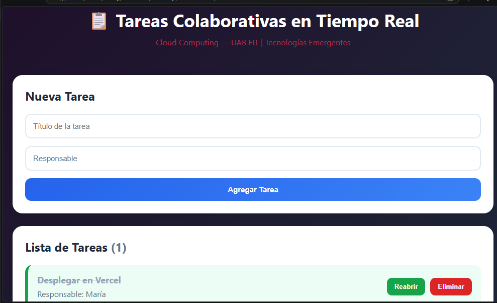
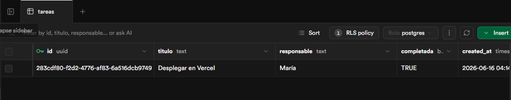
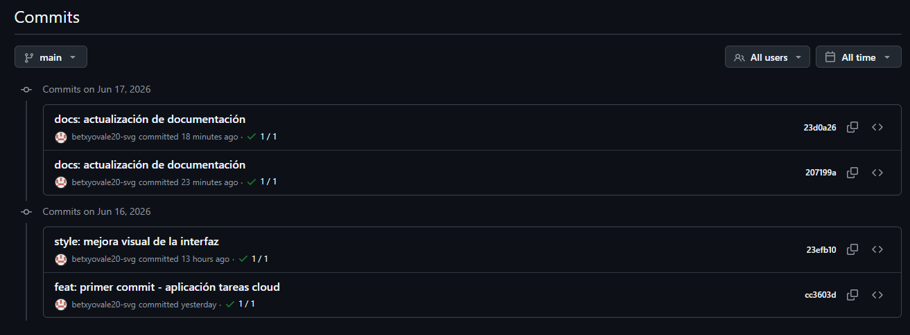
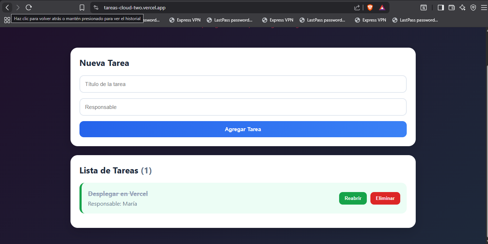

# Tareas Cloud

## Descripción

Tareas Cloud es una aplicación web colaborativa desarrollada para gestionar tareas en tiempo real utilizando tecnologías cloud. La aplicación permite registrar tareas, asignar responsables, marcar tareas como completadas y eliminarlas.

## Arquitectura

La aplicación está compuesta por:

* Frontend: HTML, CSS y JavaScript.
* Backend como servicio (BaaS): Supabase.
* Control de versiones: Git y GitHub.
* Despliegue en la nube: Vercel.

### Flujo de funcionamiento

Usuario → Aplicación Web → Supabase → Actualización en tiempo real → Usuario

## Tecnologías utilizadas

* HTML5
* CSS3
* JavaScript
* Supabase
* Git
* GitHub
* Vercel

## Capturas de pantalla

### Pantalla principal

### Base de datos en Supabase

### Repositorio GitHub

### Despliegue en Vercel

## Autor

